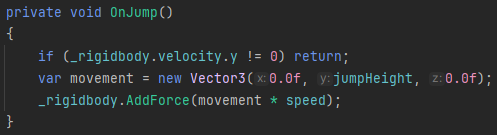
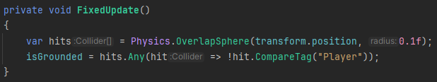
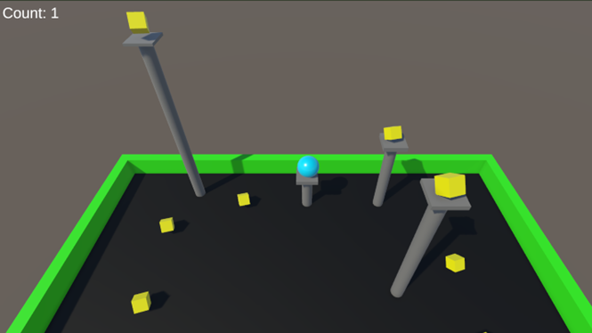

# Blog post 1 - Roll-a-ball

## Unity Roll-a-ball Tutorial Experience

I followed the Roll-a-ball Unity tutorial to get a grasp of the basics when creating a game in Unity.
I learned how to create a game with a moveable character and a win condition, by collecting objects.
I had no problems during the tutorial and got a decent feel for navigating Unity and the workflow for developing a game.
## Expanding the game

After finishing the tutorial, I wanted to improve the game by adding a jumping mechanic.
I wanted this to allow the character to also be moveable along the y-axis, to make the game more interesting.
Creating the jump mechanic was not too bad, by using AddForce to the Rigidbody in the same way the player’s movement was made,
but determining whether the ball should be able to jump turned out to be challenging.
### jump mechanic - Velocity check

I first tried checking the object’s velocity, so it was only allowed to jump when not falling or ascending,
but then I discovered that it would not be able to move downwards or upwards slopes. So, I decided not to go with this solution.

### Jump mechanic: Collision Detection

I then tried looking into trying collision detection, to only allow jumping when colliding with a surface.
I was not sure how to make the collision only trigger at the bottom of the ball.
I then found a solution to create an empty child object positioned at the ball’s bottom and using the child to check for ground collision.
This required filtering out the ball to avoid always being allowed to jump.

There was a problem though.
Because of how child objects work in Unity I did not notice that the child was not only moving with the parent, but also rotating.
This was a problem because the parent is a sphere making it so when the parent was rotating then the child was moving with the sphere.
So, when moving the ball, the bottom of the ball would move too.
But luckily, we can just set the child position to be equal to the parent’s position + the offset the child has compared to the center of the parent,
to ensure it always has the same position relative to the center of the parent, just like we did in the tutorial when the camera had to follow the player.

### Expanding the game further
I then before beginning to expand the game further added so it counted the number of pickable prefabs.
Since all pickups were children of a single parent, could I get the parent’s children count.
This made it easier to create and remove pickups without making script changes to change the win condition.

I then afterwards added some poles with a platform on top to use the jump mechanic to make it possible to try jumping up to collect some more pickups.
The poles were created as prefabs containing a cylinder and plane object, to easily reuse them. When making it this way I assumed I could easily scale the height of the poles.
But I forgot that changing the prefab scale would also change the plane object’s height making it very thick,
so I had to manually choose the cylinder scale and reposition the platform accordingly, instead of just scaling the prefab sadly.

