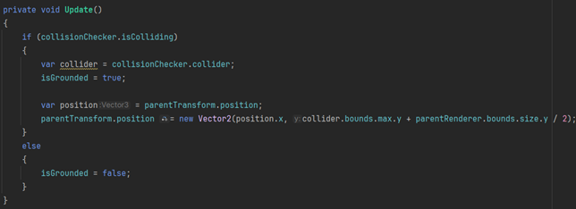
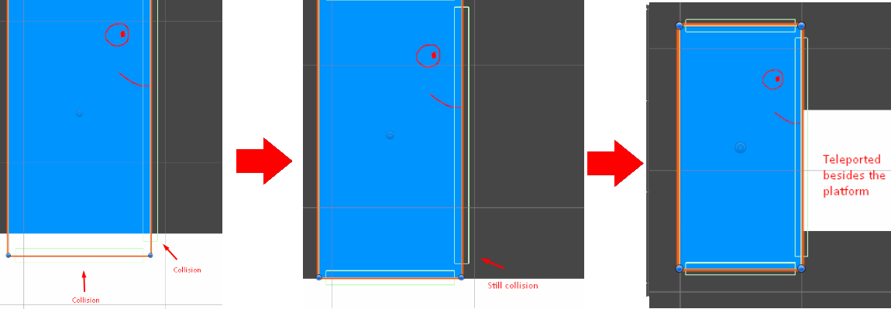
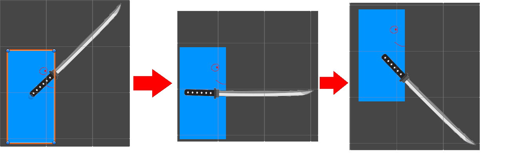

# Blogpost 3 - Dev Update 1

## Milestone 1 - Fun playable character

I started my first milestone out with making some basic platforms and a player GameObject with a Sprite, RigidBody, and Collider.

I then started using the new input system to enable player controls, allowing the Player to walk and jump using transform.Translate.

### Kinematic Player RigidBody

I wanted the player’s RigidBody to be kinematic, to maximize control over movement and prevent interactions with other GameObjects. This made me have to implement all the player physics manually, including the collisions, so the player won’t go through the static platform objects.

Making the player be kinematic was much more challenging than expected, but I still managed to implement some of the essentials. I simulated gravity to always pull the player downwards and created three child objects: GroundChecker, WallChecker, and CeilingChecker to handle collision detection for the player. I also made a flipper script that inverses the player’s localScale. This changes the sprite’s facing direction and moves the WallChecker collider, ensuring it always checks for collisions in the player’s current direction. This makes it possible to use only one WallChecker.

Here is the first iteration of the GroundChecker script:

I made the GroundChecker with a CollisionChecker script to detect collisions and identify the collider that was collided with. The script also has the responsibility for changing the player position to always stand on top of the collided object, preventing the player from occasionally being a pixel too high or too low. This was possible by using the collider’s highest position + half the height of the player sprite (because the transformPosition is centered).

One of the problems I discovered was that the player would occasionally teleport to the edge of the platforms. This happened because the CollisionChecker script checked collisions before the GroundChecker and WallChecker. So, after the GroundChecker corrected the position, the WallChecker would still use the already detected collision.

Here is the problem visualized:

The way I fixed this was to make the CheckCollider include a method for collision checks, ensuring the WallChecker would call this method after GroundChecker has updated the position. Despite this adjustment, I still had to add `Physics2D.SyncTransform()` to immediately update the player’s position before the WallChecker.

### Attack animation

Next, I made a sword sprite for the player with an attack animation involving three keyframes that adjust the sword’s position and rotation, simulating a swinging attack. The sword is hidden until the player attacks, which is done by activating the sword when the attack animation begins and then deactivating when in idle state. Not sure if this is a bad way to do it, might revisit this solution later.

The three Attack keyframes:

The last thing that got implemented in this milestone was the ability to make the player dash. I wanted to do much more for the player movement, but I thought that combat was too important in this game to delay it further. So, I decided to start on the next milestone "Challenges" instead.
