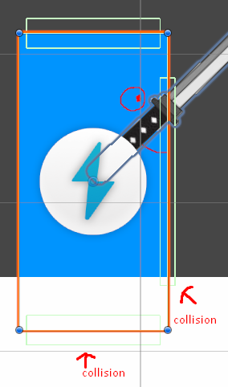
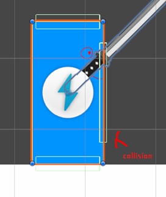

# Blogpost 3 - Dev Update 1

### Milestone 1 - Fun playable character
**Last updated:** Commit: "The player now jumps after dashing if tried to jump during the dash"

## Notes

- **Player Features:**
    - Can move, jump, flip, dash, and attack.
    - Will keep fine-tuning numbers to make the player's movement better as the game progresses.

- **Player Physics:**
    - The player is kinematic and does not get impacted by physics.

- **Code Structure:**
    - Created three different children and scripts for ground, wall, and ceiling checkers. This was necessary due to differing logic, but reused some code via a `CollisionChecker` script.
    - Separate scripts handle different player functionalities, such as flip, dash, and collide. (Note: Might separate controller, movement, and jump into different scripts.)

- **Wall Checker:**
    - Only has one wall checker in the direction the player faces, which moves with the character flip instead of having two wall checker children.

### Problems:
- **Collision:**
    - Multiple collisions at once.
    - Ensuring the player does not stay on top of or inside objects when colliding.
    - Ceiling and ground colliders had to check before wall collisions.

- **Changing direction while dashing:**
    - The CheckCollision script had to run before all ground, wall, and ceiling checkers. After the ground checker moved the player to the top of the ground, the wall checker's CheckCollision script would still register a collision even if not colliding with any walls.

One of the problems:    
Falling because of gravity making player inside the ground, triggering collision for both Ground and wallCheckers.

GroundChecker runs first moving the player on top of the ground, but wallChecker still registers same collision from before.

Meaning the player would teleport to one of the edges of the platform.

Solution:
Made the CheckCollider script instead have a method that can check for collisions, so now the different CheckColliderschecks for collision and updates position and then the next collider script checks again for collision instead of using same collider.
Also added “Physics2D.SyncTransforms();” to update the player’s position after a collisionChecker has moved the player immediately, before the next collisionChecker script will run.