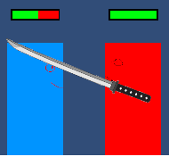
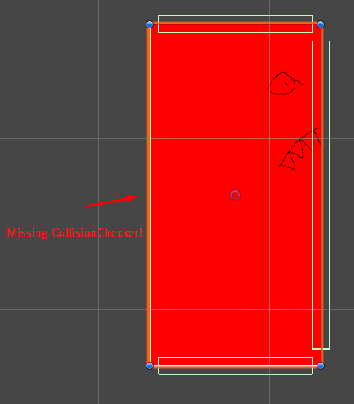
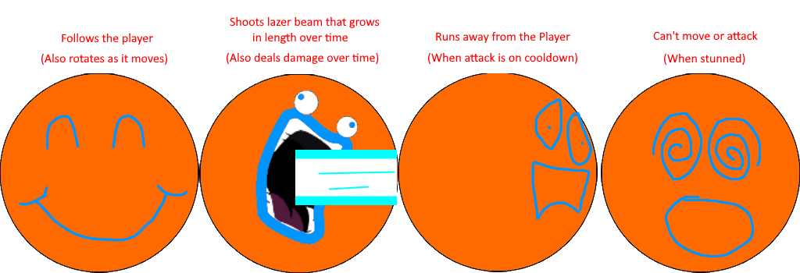

# Blogpost 4 - Dev Update 2

## Milestone 2 - Challenges

In the second milestone, I wanted to make some enemies for the player to fight against. The first enemy I wanted to create was an evil clone of the player named EvilSamu. The idea behind EvilSamu was that he should be able to move, jump, and attack just like the player. So, I thought it could be interesting to see how much of the code I have made so far could be reused.

I could reuse the CollisionCheckers and the movement script for EvilSamu with little problems. The logic to control what movement actions to chase the player was made in a DirectMovementAI script, and a Controller script was used to control whether to chase or attack the player. To explain EvilSamu, you could say he operates just like the player, but his actions are instead controlled by scripts rather than player input.

The next thing was to make the player and enemies able to attack and kill each other. To do that I had to create a Health script to store their current and max health. It also was used to regenerate HP over time for the player, display their CurrentHealth, and destroy the object when CurrentHealth reaches zero. An AttackHandler script was also created to check for collisions to deal damage.

To make the combat more interesting, a KnockBackHandler was created to enable the player to knock enemies away and stun them. This implementation was challenging for multiple reasons. Firstly, because of the decision to use kinematic RigidBodies, which caused the enemies to move through walls instead of stopping.

This was a problem because the enemies only have a CollisionChecker in the direction they are looking and not in their backs:

Initially, I considered adding another CollisionChecker behind them, but decided not to since I could not figure out a way to reuse the already existing CollisionChecker script without having to create a new one. Instead, I made the collision responsibilities within the KnockBackHandler to reposition the enemies, which worked fine. But as I am writing this post, I realized that in hindsight, this was probably a bad decision, since the problem would arise again if I wanted, for example, the enemies to be able to walk backwards. Meaning that a BackWallChecker of some sort would have been the better solution to prevent future problems like this. I might come back and change this; we will see.

After all this, I decided to create a new enemy named MoodSwinger. The idea behind MoodSwinger is he changes his mood as he changes his action. Here is how he looks:

Some extra noteworthy things to mention about the MoodSwinger is that it uses an AIStateHandler script to decide which state to be in, that tells the Controller script what script to be active. I was kind of lazy and just made a new LaserAttackScript script that copied some code from the Attack method the Player and EvilSamu used, to keep going, but should probably have divided the code up in some way instead.

I decided to finish this milestone earlier than expected. Originally, the first level should have been beatable now, but I have instead moved it to the next milestone.
