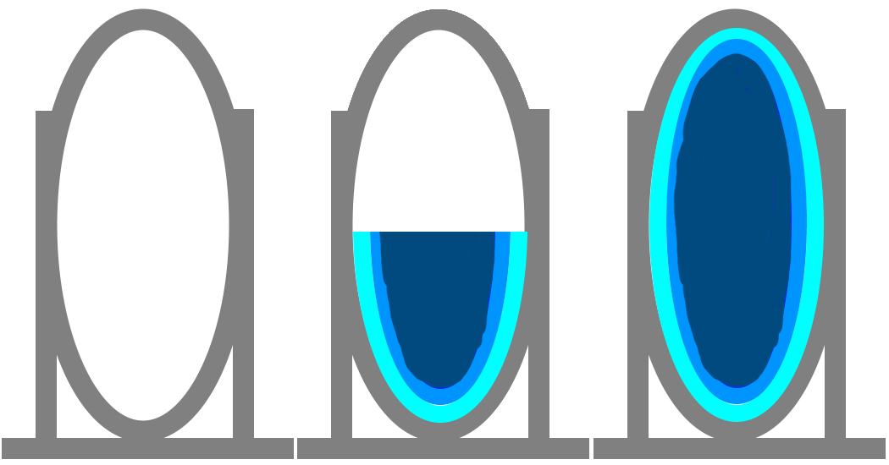
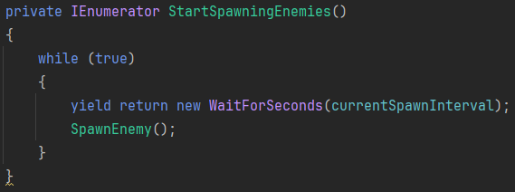
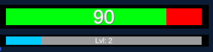
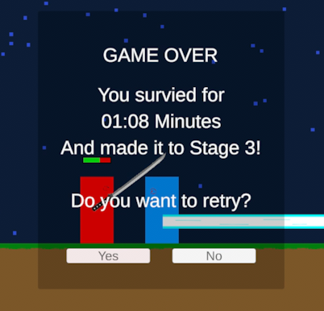
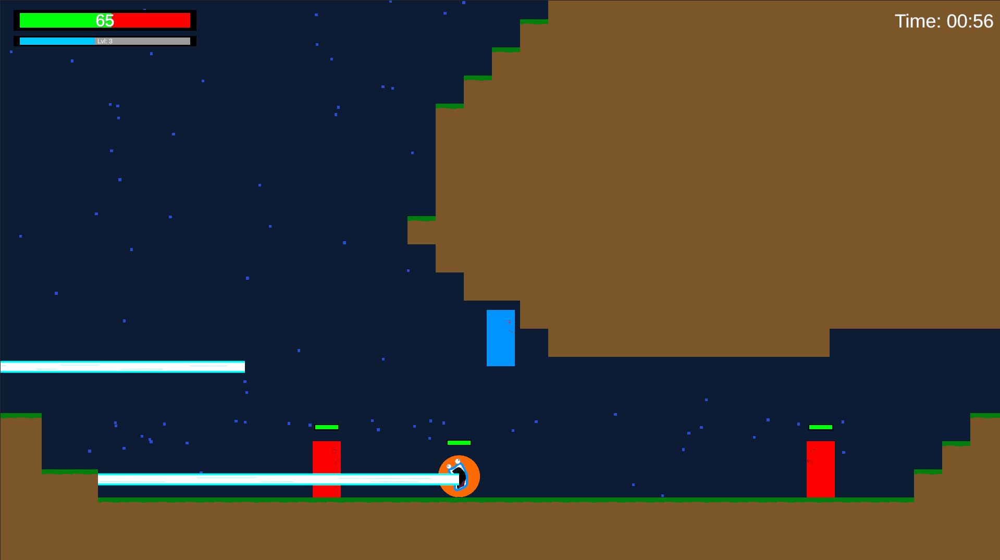

# Blogpost 4 - Dev Update 2

## Milestone 3 - Powerups

In the third and final milestone, the primary objective was to strengthen the enemies over time and introduce power-ups to help the player combat these challenges as well to make the player feel like a god going from zero to hero. Because I did not accomplish the goal of making a beatable level in my second milestone, I started out focusing on this before the powerups.

So, I introduced a teleporter that charges slowly and once finished charging, allows the player to jump in and go to the next stage.

I then implemented automatic enemy spawns outside the camera view, with randomized selection process for enemy types. The enemySpawner should probably have accounted for cases where multiple enemies spawn in a row, to prevent for example one enemy appearing five times in a row, but this was not implemented.

I then created a levelingManager to make the player and enemies stronger. It accepts an attack interface and the health script, enabling it to level up different kinds of attacks and their health. This manager also tracks the player’s experience gained from defeating enemies, which is not ideal since the enemies do not use the experience system to get stronger.

Instead of the experience system, the enemies instead used a difficulty manager to decide their level. Their level scaled based on time passed and the stage number. With this I also added so the enemies spawn frequency increased with difficulty as well. Originally, the enemySpawner script used InvokeRepeating to spawn an enemy every spawnInterval. However, with the changing spawnInterval, I had to stop the invoke and start a new one every time the spawnInterval changed. To fix this problem, I decided to instead use a coroutine that waits the variable spawnInterval, so the variable can keep changing value without breaking anything.

Since this was the last milestone, I started also polishing the game a bit. I created a HUD that displays current health and experience process and level for the player.

A main menu and a game over screen that displays the survival time and makes it possible to restart the game or exit to main menu again.

To expand the game environments was also needed, because up until now there have been no real places to go. So, I developed a simple tilemap with a grass tile and a dirt tile as pallet. I then added a rule tile for the pallet that would ensure the grass tile only would be placed when no tile was above it. This worked fine to create some more content for the game, but it did not look the best, since there was very little variety in the tiles.  
Here is how the two tiles look:

The last things added were some sound effects, background music and rain to improve the player experience.

That was what I managed to accomplish in this final blogpost. I had planned to make much more such as the player earning money from killing enemies that could be used to open chests that could be found randomly around the world, with cool unique powerups in this milestone. But even so, I am still happy with the result overall.