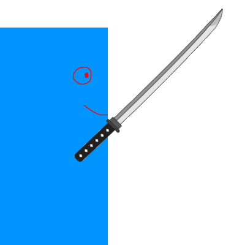
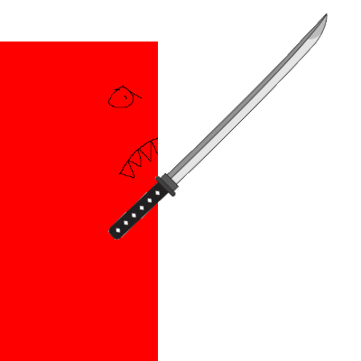

# Game Show-Off

## SPEEDY SAMU

Speedy Samu is a 2D action platformer designed to motivate with mastery and challenges. Learn to fight dangerous enemies and go from vulnerable and weak to powerful and strong as you strive to survive for as long as possible in this scary world.

You play as Speedy Samu, a mobile fast samurai fighter that can run, jump, attack and dash.

But be careful, as enemies spawn from both sides to chase and attack you. Meet EvilSamu and MoodSwinger.

EvilSamu is an evil clone created from Speedy Samu’s genes, he can run, jump and attack just like Speedy Samu. But there were some things that were not able to be recreated from Speedy Samu, his speed. Compared to Speedy Samu, is EvilSamu much slower and does not have the ability to dash.

The other enemy Speedy Samu must face is the MoodSwinger. The MoodSwinger’s behavior changes often, depending on his mood. When he is happy, he looks for you, when he sees you, he attacks you with a charging laser beam that grows. He gets scared and flees away from you, when he has used his laser attack and cannot make a new one. He gets confused when attacked, making him unable to do anything.

And be careful, as the enemies grow stronger and increase in spawn frequency over time. They will gain more health, do more damage, attack faster and more often.

However, you can fight back with your samurai sword to stun and knock them a little bit away from you and you will regenerate some of your health back over time. You can also grow stronger by filling your experience bar to full to level up and gain strength just like the enemies do!

Your goal is to survive the enemies for as long as possible, as well as find portals scattered around. When finding a portal, you can touch it to make it start charging. When fully charged you can jump in to get teleported to the next stage. You can continue this cycle infinitely, so try to get the highest stage count and survival time.

When you die a GameOverScreen will show you some stats, like how long you survived and the stage you reached. Then you can choose to retry a new run, or go back to the main menu.

So, that was Speedy Samu. Right now, it does not have much content, but I have tried to make the content as repayable as possible. I think the game will shine much more when introducing more random elements, like opening chests that grants random powers, to make each playthrough different than the last and perhaps more than just two different stages and enemies. But all in all, I still think it turned out to be great.